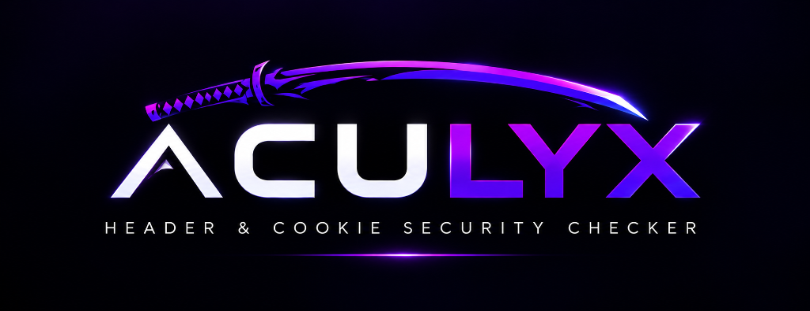

<p align="center">
  
</p>

<p align="center">
  <strong>Passive HTTP Header &amp; Cookie Security Analysis for Chromium &amp; Firefox</strong><br>
  <em>Created and authored by Dhyan Patel</em>
</p>

<p align="center">
  <a href="#features">Features</a> &bull;
  <a href="#privacy--zero-telemetry">Privacy</a> &bull;
  <a href="#cli-usage">CLI</a> &bull;
  <a href="#development--testing">Development</a> &bull;
  <a href="#license--trademark">License</a> &bull;
  <a href="docs/PROVENANCE.md">Provenance</a>
</p>

---

## Overview

**ACULYX** is a local-first, privacy-preserving browser extension built on Manifest V3 for Chromium and Firefox. It passively inspects HTTP security headers, cookie attributes, and subresource API communications as you browse, computing a real-time security grade and actionable remediation guidance without sending any data off your machine.

Because ACULYX evaluates traffic within the browser's own authenticated network context, it audits internal endpoints, dashboards, and logged-in states without requiring credential storage, active crawling, or synthetic penetration probes.

---

## Features

- **Real-Time Passive Inspection**: Evaluates response headers and cookie configurations continuously during active navigation.
- **Two-Stage Redirect Tracking**: Observes headers at `onHeadersReceived` and `onResponseStarted` across every redirect hop to catch intermediate header stripping and internal HSTS upgrades.
- **Privacy-Safe Cookie Jar Correlation**: Cross-references `Set-Cookie` response headers with the live browser cookie jar to identify prefix compliance (`__Host-`, `__Secure-`), missing `HttpOnly`/`Secure` flags, `SameSite` misconfigurations, and CHIPS partitioning. **Cookie values are never accessed, persisted, or exported.**
- **Deep CSP Evaluation**: Leverages Google's `csp_evaluator` to detect script execution bypasses, JSONP endpoints, missing nonces/hashes, wildcard origins, and dangerous fallback directives.
- **Subdomain Trust & Escalation**: Identifies dangerous subdomain trust bridges where wildcard cookies (`domain=.example.com`) or permissive CORS configurations expose parent-domain sessions to subdomain compromise.
- **Attack Surface Graph**: Interactive, bounded D3-force graph mapping same-apex origin relationships, discovered endpoints, and cookie scoping trees.
- **Auth Posture & History Diffing**: Tracks origin security posture across sessions, highlighting newly introduced header regressions or resolved security weaknesses upon authentication state changes.
- **Cross-Surface Adaptive UI**: Unified cyberpunk-inspired interface across the Popup, full-page Options dashboard, and Firefox-compatible Side Panel, featuring custom theme tokens, compact densities, and reduced-motion accessibility.
- **Developer CLI & CI/CD Pipeline**: Standalone CLI (`npm run aculyx`) supporting live URL audits, offline JSON/HAR inspection, regression diffs, and GitHub Actions-ready SARIF 2.1.0 output with configurable exit codes (`--fail-on high`).

---

## Privacy & Zero-Telemetry Guarantee

ACULYX is built on strict fail-closed privacy invariants:

1. **No Sensitive Value Storage**: Extension code never reads `cookie.value`, authorization credentials, bearer tokens, or URL query parameters. All query parameters (`?`) and fragments (`#`) are stripped before URLs enter session state, storage, or exports.
2. **Strict Network Isolation**: Extension pages declare `connect-src 'none'` in their Content Security Policy. The extension runtime cannot make outbound HTTP/WebSocket requests.
3. **100% Local Processing**: All evaluation, scoring, D3 graphing, and report generation execute locally on your device.
4. **Isolated Incognito Handling**: Incognito and private browsing events never touch persistent storage (`localStorage`), history records, or the attack-surface graph.
5. **No Telemetry**: Zero analytics, zero crash reporting, zero tracking pixels, zero remote script loading.

> [!NOTE]
> The only command that contacts an external network endpoint is the standalone CLI when invoked with the explicit `--url` flag to fetch HTTP headers for terminal audit.

---

## Architecture & Rules Evaluated

ACULYX audits network traffic against a versioned, defensive rule engine (`src/rules/`):

- **Transport Layer**: Strict-Transport-Security (HSTS), preload readiness, `includeSubDomains`, minimum one-year `max-age` verification.
- **Content Security**: Content-Security-Policy (CSP), `default-src`, `script-src` nonces/hashes, `object-src 'none'`, `base-uri`, and `frame-ancestors`.
- **Framing & Sniffing Protection**: X-Frame-Options (XFO) and X-Content-Type-Options (`nosniff`).
- **Cookie Security**: Flags missing `Secure`, `HttpOnly`, `SameSite=Strict/Lax`, validates `__Host-` and `__Secure-` prefix requirements, and checks `Cache-Control: no-store` on responses issuing cookies.
- **CORS & Cross-Origin Policies**: Cross-Origin-Opener-Policy (COOP), Cross-Origin-Embedder-Policy (COEP), Cross-Origin-Resource-Policy (CORP), and `Access-Control-Allow-Origin` null/wildcard misuse on API responses.
- **Subresource Integrity (SRI)**: Scans HTML scripts and stylesheets for cryptographic hash integrity attributes (`sha384`/`sha512`).
- **Information Disclosure**: Detects product and server version leakage in `Server`, `X-Powered-By`, and generator headers.

---

## CLI Usage

ACULYX provides an offline-first CLI tool for local audits and CI/CD pipelines:

```bash
# Live URL audit
npm run aculyx -- --url https://example.com --format markdown

# Offline inspection of pre-captured JSON or HAR
npm run aculyx -- --input audit.json --format sarif --fail-on high
npm run aculyx -- --har capture.har --url https://example.com/api --format json

# Baseline regression diff
npm run aculyx -- --input current.json --diff baseline.json --format markdown

# Legacy compatibility alias
npm run seccheck -- --url https://example.com
```

### Exit Codes
- `0`: All checks passed below `--fail-on` threshold.
- `1`: One or more findings met or exceeded the failure threshold (default: `high`).
- `2`: Invalid CLI arguments or malformed input data.

---

## Development & Testing

### Prerequisites
- Node.js ≥ 22.12.0
- npm ≥ 10

### Installation & Builds
```bash
# Install dependencies
npm install

# Build Chrome MV3 extension (outputs to dist/)
npm run build

# Build Firefox MV3 extension (outputs to dist-firefox/)
npm run build:firefox

# Development mode with HMR
npm run dev
```

### Quality & Verification Gates
ACULYX enforces a strict zero-tolerance gate policy:

```bash
# 1. Typecheck (zero TypeScript errors)
npm run typecheck

# 2. Strict Lint (zero warnings, zero errors, zero eslint-disable)
npm run lint -- --max-warnings=0

# 3. Unit & Integration Tests (454 tests across 32 test suites)
npm test

# 4. Playwright End-to-End Tests (persistent Chromium context)
npm run test:e2e

# 5. Dependency Audit (zero vulnerabilities at low level)
npm audit --audit-level=low
```

---

## Project Structure

```
src/
├── background/       # MV3 service worker — capture, write barrier, lifecycle
├── content/          # Isolated page signal detectors (CSP, SRI)
├── options/          # Full-page settings & About/Copyright dashboard
├── popup/            # Extension action popup & live scoring interface
├── rules/            # Pure TypeScript rule engine, weights, registry
├── sandbox/          # Sandboxed iframe verification workspace
├── shared/           # Appearance tokens, storage write-barrier, messaging
└── sidepanel/        # Attack Surface Graph & entity relationship explorer
tests/
├── background/       # Permissions, state pipeline, capture listener tests
├── e2e/              # Playwright browser integration tests
├── fuzz/             # Property fuzzing and payload mutators
├── integration/      # Write barrier races, reset drainage, canary leak suites
├── rules/            # Header family fixtures and evaluation assertions
└── shared/           # Storage envelopes, coalescing, and migration tests
```

---

## Author & Ownership

ACULYX is developed, authored, and owned by **Dhyan Patel**.

- **Author**: Dhyan Patel
- **Official Repository**: [github.com/Gone27/Cookie-and-header-reader-extention](https://github.com/Gone27/Cookie-and-header-reader-extention)
- **Provenance Record**: See [`docs/PROVENANCE.md`](docs/PROVENANCE.md) for cryptographic asset checksums and build verification instructions.

---

## License & Trademark

- **Source Code**: Licensed under the **Apache License, Version 2.0** ([`LICENSE`](LICENSE)).
- **Brand & Trademark**: The name **ACULYX**, the katana wordmark, and associated graphical marks are proprietary brand assets and trademarks of **Dhyan Patel**. The Apache 2.0 software license does not grant trademark or brand rights to use the ACULYX name or logo in derivative works or distributions without prior express written permission. See [`NOTICE`](NOTICE).
